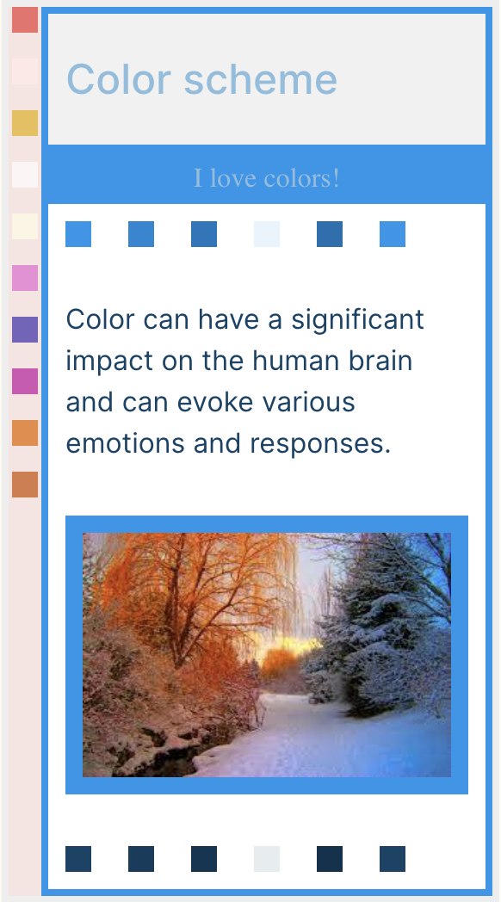
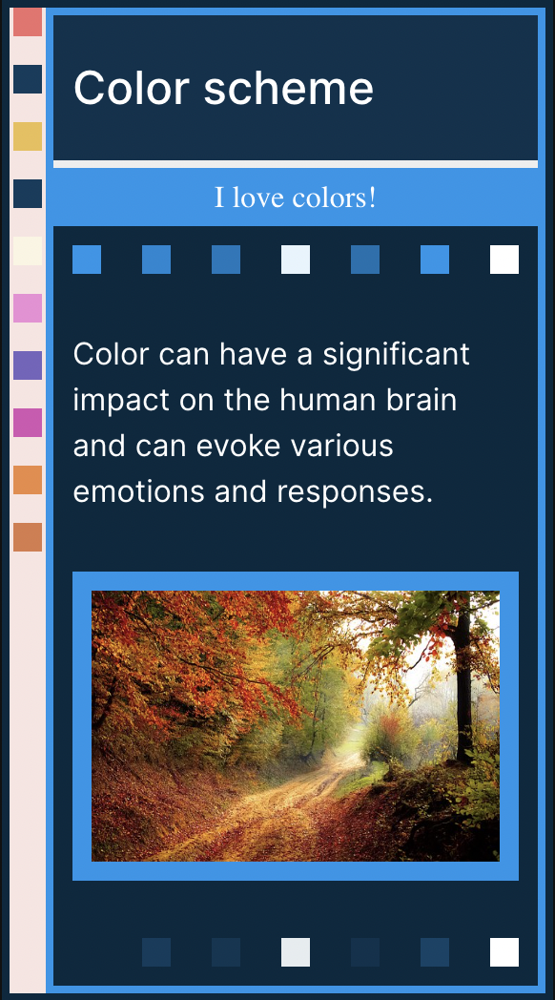

# Celebrating the Beauty of Winter with Color Schemes

Winter is upon us, bringing with it crisp air, blankets of snow, and an icy cool landscape. While some people may dread the cold, others can’t help but be in awe of the breathtaking beauty winter brings. And, what better way to celebrate the season than by incorporating its cool hues into your design work?

A monochromatic color palette inspired by winter is a great way to keep your look modern and stylish. The cool, calming tones of blue, green, and gray evoke a sense of serenity and peace, making them perfect for designs that aim to evoke a sense of tranquility. Whether you’re working on a website, a logo, or any other design project, incorporating a winter color scheme is a great way to capture the essence of the season.

In this winter color scheme package, you will find a range of hues inspired by the cool tones of winter. From deep blue to soft gray, each color has been carefully selected to work seamlessly together, giving you the tools you need to create a cohesive and stylish design.

So, whether you’re working on a winter-themed project or just looking for a new way to update your design work, this winter color scheme package is the perfect starting point. So, grab your blanket and hot beverage, and get ready to embrace the beauty of winter through color.

&nbsp;&nbsp;&nbsp;&nbsp;&nbsp;&nbsp;&nbsp;&nbsp; 
